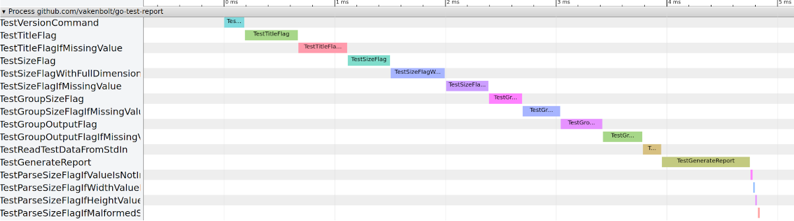

# go-test-trace

convert go test report JSON into chrome tracing JSON

`go test -json | go-test-trace`

Example from github.com/vakenbolt/go-test-report:



Example:
[test report.json](test_report.json)

### Trace Format

The Trace Event Format is the trace data representation that is processed by the Trace Viewer application.

<https://docs.google.com/document/d/1CvAClvFfyA5R-PhYUmn5OOQtYMH4h6I0nSsKchNAySU/preview>

> The JSON Object Format allows for more flexibility in the data passed to Trace Viewer.

```json
{
  "traceEvents": [
    {"name": "Asub", "cat": "PERF", "ph": "B", "pid": 22630, "tid": 22630, "ts": 829},
    {"name": "Asub", "cat": "PERF", "ph": "E", "pid": 22630, "tid": 22630, "ts": 833}
  ],
  "displayTimeUnit": "ns",
}
```

### Trace Viewer

Trace-Viewer is the javascript frontend for Chrome `about:tracing` and Android systrace.

<https://chromium.googlesource.com/catapult/+/HEAD/tracing>
(mirrored at <https://github.com/catapult-project/catapult/tree/master/tracing>)

It provides rich analysis and visualization capabilities for many types of trace files.

```sh
$CATAPULT/tracing/bin/trace2html my_trace.json --output=my_trace.html
```
